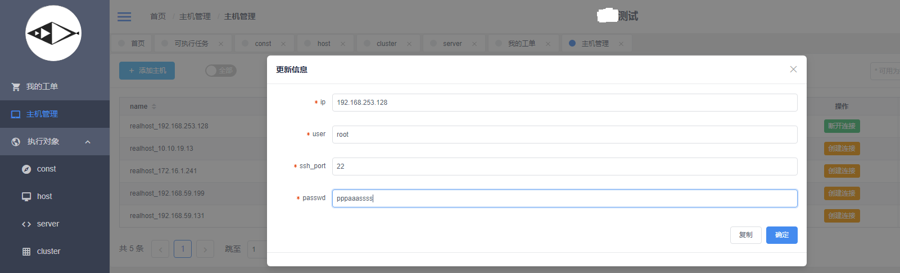
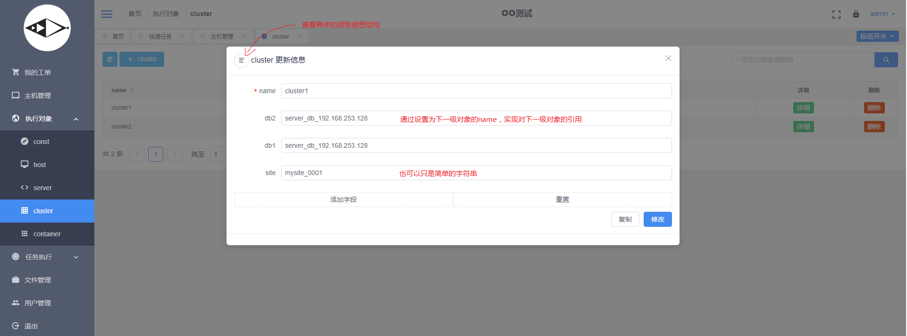

# solve-简单命令分发服务 使用文档 #

文档更新可能不及时，请实际参考web的界面逻辑。


登陆
--------------

登陆支持普通的账号密码（第一次登陆需要使用初始化时设置的账号密码)以CAS登陆（需要配置CAS地址）


主机管理
--------------



设置用于ssh连接使用的参数。  
手动控制ssh连接状态（在命令执行中不是必须，只是用于管理，命令执行会自动连接）。


执行对象
--------------




对于上述的cluster1，其信息可认同为  

|原始字段信息|扩展后字段信息|
| :--- | :---- |
|"name": "cluster1"                  |"name": "cluster1"               |
|"db2": "server_db_192.168.253.128"  |"db2": {"name":"server_db_192.168.152.128", "const":"const123", "host":"realhost_192.168.253.128", "db_port":"1039"}|
|"site": "mysite_0001"               |"site": "mysite_0001"             |
|...                                 |...                           |


可以多层嵌套，如上述的server_db_192.168.152.128可以在host字段中进行再一次嵌套


在参数替换时：

|参数替换格式|替换后的字符值|
| :--- | :---- |
|\{\{db2\}\}           |server_db_192.168.253.128 |
|\{\{db2.host\}\}      |realhost_192.168.253.128  |
|\{\{db2.host.ip\}\}   |192.168.253.128           |


playbook
--------------
```shell
#最简单playbook的样例

#跳转的主机
[192.168.253.128] 
#执行的命令
echo "hello world"
```

### playbook可以实现 ###
* 主机跳转
* shell命令执行
* 文件上传
* 文件下载 


核心思想的是playbook的一行对应一个单行shell命令，可以使用\{\{XXX\}\}格式的模板语言实现参数引入。  
详细的playbook说明可以查看solve的README.md。  


简单任务模板
--------------


将执行对象的类型与playbook绑定，同时设置其他相关参数。playbook的值为存在服务器上的路径。


简单可执行任务
--------------

单击模板的生成任务进入任务设置页面


设置并保存后生成可执行任务


双击对应的行可以查看可执行任务的信息


单击执行进入执行前设置页面。第一步为设置session参数(这个示例没有使用)。


第二步为模板信息、执行对象信息确认。**单击执行即运行任务。**


快速任务
--------------


只需要在主机管理中设置涉及的主机，可以动态配置执行信息与执行命令快速生成任务，playbook与常规任务格式类似（没有session参数与执行对象参数，增加分割参数如 {{\_1}} {{\_2}} ，对应配置信息分割后的第一个参数、第二个参数），每一行配置信息一个并发（也可以选择串行执行）。


执行结果查看
--------------
单击执行后跳转显示执行列表，或者在我的工单中选择。


在行中双击右边弹出对应对象所执行命令的列表


单击查看对应命令的执行信息


选择字段后可以导出成csv文件（同任务中所有执行对象的都导出，选择字段的顺序即为csv文件中字段的顺序）


高级用法
--------------

### global参数 ###
playbook
```shell
#全局变量可以跨主机引用
#声明 global.XX="YYYY"  
#或   global.XX=`who`    可将在当前主机(不是solve所在的主机)执行命令的结果作为全局变量
#引用 {{global.XX}}
#对cluster执行
[{{db1.host.ip}}]
global.v1=`ifconfig | grep -oP "(?<=addr:).*?(?=  Bcast)"`

[{{db2.host.ip}}]
echo "{{global.v1}}" > /tmp/`date +%Y%m%d`.test
```
global参数主要用于上下文参数的传递


### session参数 ###
playbook
```shell
#session参数用于在运行时输入
#运行时需要预先设置session参数
[{{db1.host.ip}}]
echo {{session.var1}} {{session.var2}} {{session.var3}} > /tmp/test_`date +%Y%m%d`
echo {{session.var2}} >> /tmp/test_`date +%Y%m%d`
echo {{session.var1}} >> /tmp/test_`date +%Y%m%d`
echo {{session.var4}} >> /tmp/test_`date +%Y%m%d`
echo {{session.var2}} >> /tmp/test_`date +%Y%m%d`
```

web页面输入


### 文件上传 ###
playbook
```shell
#上传本地文件到远端
# 本地文件绝对路径 远端目录
#远端目录如果不存在 则创建一个
#远端文件如果存在 则使用时间戳重命名远端文件
#选择cluster操作
[{{db2.host.ip}}]
global.xx=`date +%s`_$RANDOM
PUT:{{session.file_to_send}}:/tmp/upload_test/{{site}}/x
#cat /tmp/`basename {{session.file_to_send}}`
echo "xxx"
```

web页面输入


### 文件下载 ###
playbook
```shell
#下载远端的文件到本地
# 本地目录 远端文件绝对路径  
#如果本地文件存在 则使用时间戳重命名现有文件
#如果本地目录不存在 则创建
#选择cluster进行操作
[{{db1.host.ip}}]
GET:/tmp/x/a/b:{{session.file_2_get}}
```

web页面输入


### 后台运行 ###

playbook
```shell
#可以实现跨主机后台运行
#对cluster执行
[{{db1.host.ip}}]
echo "xxx"
sleep 3 &
sleep 4 &

[{{db2.host.ip}}]
sleep 2 &
sleep 1 &
wait

echo "zzzz"
```
类似于shell的&/wait用法，wait阻塞等待所有后台命令结束。  
如果所有后台命令返回码都为0以及错误输出都为空，则wait返回正常，即可执行下一命令。否则终止执行。


### session描述 ###
playbook
```shell
#
[{{db1.host.ip}}]
echo {{session.eee}}
echo {{session.aaa}}
echo {{session.ccc}}
echo {{session.ddd}}
echo {{session.bbb}}
```
参数描述文件
```yaml
# 可以使用单独文件写session的限制信息 用于web前端的限制
# 文件名为"playbook文件名"+".conf"
session:
  -
    key: aaa
    comment: 输入的值使用正则表达式进行限制
    type: input
    constrict: (^\S.*\S$)|(^\S$)
  -
    key: bbb
    comment: 单选
    type: select 
    constrict: 
        - 111
        - 222
        - 333
  -
    key: ccc
    comment: 文件上传 文件通过web页面上传到solve所在的服务器，返回的路径信息可用于向其他主机分发
    type: upload

  -
    key: ddd
    comment: 多选 脚本引用时多个选项使用空格分隔
    type: multiselect
    constrict:
      - qqqq
      - wwww
      - eeee
      - rrrr
      - tttt
```

web页面输入


### 断点执行 ###
```shell
#
# 注释
#
[{{db1.host.ip}}]

echo {{session.aaa}}

echo {{session.bbb}}

echo 111
echo 222
echo 333


echo 444


echo 555
```

```yaml
session:
  -
    key: aaa
    comment: 选择时间
    type: datetime
  -
    key: bbb
    comment: 选择时间
    type: datetime
#pause: 5
pause: [3,6,10,18]
#pause: 
#  - 5
#  - 7
#  - 9
#pause 表示执行到第几行时暂停，该行处于暂停等待之后的控制
#可以为单个数字或者list，list则表示继续执行时之后继续存在阻塞
```

执行时选择断点执行，则参数描述文件中的pause不生效，逐行运行，或者直接运行所有，或者终止所有


正常执行，则强制使用pause的定义进行阻塞，即使中途改种逐行调试pause的定义依然生效，可以终止所有


